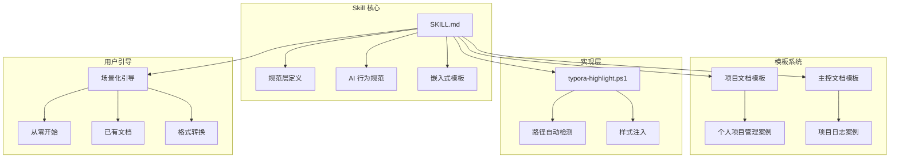

## 用户需求

用户创建了 md-project-manager 技能，但发现以下问题需要改进：

### 核心问题

1. **技能内容过于粗略**：SKILL.md 描述不够详细，缺乏使用示例和场景化引导
2. **路径兼容性问题**：typora-highlight.ps1 使用硬编码路径 `$env:APPDATA\Typora\themes`，不同用户安装路径不同导致脚本失效
3. **缺乏用户引导**：不能很好地引导用户理解"主文档"（A项目管理.md）和"项目文档"（项目X.md）的关系和使用逻辑
4. **模板集成与调用**：模板只是外部文件引用，没有集成到技能中，无法直接调用

### 期望改进

- 技能应从头到尾引导用户，根据不同功能情境创建相应内容
- 将示例模板（个人项目管理案例、项目日志案例）直接嵌入 Skill 中
- 引导用户根据示例模板创建属于自己的模板
- 修复 Typora 脚本的路径兼容性问题

### 功能内容

- 完整的项目管理流程引导（从零开始/已有文档/格式转换三种场景）
- 嵌入式模板示例，方便 AI 直接调用和参考
- 智能路径检测和编辑器适配
- 详细的 AI 行为规范和标记语法说明

### 视觉效果

- Typora 中高亮样式为柔和淡蓝色底色（#E3F2FD）
- 脚注链接为深蓝色（#1976D2）
- 文档结构清晰，使用表格、代码块、流程图展示

## 技术栈

- **文档格式**：Markdown (.md)
- **脚本语言**：PowerShell (.ps1)
- **版本控制**：Git
- **目标编辑器**：Typora（主要）、Obsidian/VS Code/Logseq（扩展）

## 技术架构

### 系统架构



### 模块划分

1. **SKILL.md 核心模块**

- 概述与核心理念
- 文件结构与分工说明
- 嵌入式模板示例
- AI 行为定义与标记语法
- 场景化使用引导
- 编辑器适配指南
- 常见问题与故障排除

2. **模板系统模块**

- 项目文档模板（含填充示例）
- 主控文档模板（含填充示例）
- 模板定制引导

3. **实现层模块**

- Typora 路径自动检测
- 样式注入逻辑
- 错误处理与用户提示

4. **文档模块**

- README.md（项目介绍）
- quick-start.md（快速上手）

### 数据流

用户激活 Skill → AI 读取 SKILL.md → 根据用户场景引导 → 生成/更新文档 → 同步主控面板

## 实现方案

### 方案核心思路

**问题1：技能内容过于粗略**

- 重写 SKILL.md，增加详细说明和示例
- 添加场景化引导（从零开始/已有文档/格式转换）
- 增加常见问题和故障排除章节

**问题2：路径兼容性问题**

- 改进 typora-highlight.ps1，增加多路径检测
- 添加注册表查询作为备选
- 添加用户手动输入路径的回退机制

**问题3：缺乏用户引导**

- 在 SKILL.md 中添加"快速开始"章节
- 使用流程图说明主文档和项目文档的关系
- 提供三种场景的详细引导流程

**问题4：模板集成与调用**

- 将模板内容直接嵌入 SKILL.md
- 提供填充示例，展示如何使用模板
- 添加模板定制引导，教用户创建自己的模板

### 关键技术决策

1. **模板嵌入方式**：在 SKILL.md 中使用代码块嵌入完整模板，方便 AI 直接复制和修改
2. **路径检测策略**：按优先级检测常见安装路径 → 注册表查询 → 用户手动输入
3. **场景引导设计**：使用决策树引导用户选择合适的场景，避免信息过载
4. **示例内容设计**：使用"个人项目管理"和"项目日志"两个完整案例，覆盖主要使用场景

### 性能考虑

- SKILL.md 文件大小控制在合理范围内（< 500行）
- 模板嵌入使用折叠式结构，避免一次性加载过多内容
- 脚本执行效率优化，减少不必要的文件遍历

## 实现细节

### 目录结构

```
md-project-manager/
├── README.md                    # [MODIFY] 更新项目介绍和目录结构
├── skill/
│   └── SKILL.md                 # [MODIFY] 核心改进：重写技能定义
├── templates/
│   ├── project-template.md      # [KEEP] 保持现有模板
│   └── dashboard-template.md    # [KEEP] 保持现有模板
├── examples/
│   └── typora-highlight.ps1     # [MODIFY] 修复路径兼容性
└── docs/
    └── quick-start.md           # [MODIFY] 更新快速上手指南
```

### 文件修改详情

#### 1. SKILL.md [核心改进]

**修改内容**：

- 重写概述，增加核心理念说明
- 添加"快速开始"章节，包含三种场景引导
- 嵌入项目文档模板和主控文档模板的完整示例
- 添加填充示例，展示如何使用模板
- 增加模板定制引导
- 完善 AI 行为定义和标记语法
- 增加编辑器适配的详细说明
- 添加常见问题和故障排除章节

**关键结构**：

```markdown
---
name: md-project-manager
description: 用于 Markdown 项目管理的 Skill...
---

# MD 项目管理 Skill

## 概述
[核心理念和功能说明]

## 快速开始
### 场景1：从零开始
[详细引导流程]

### 场景2：已有文档
[详细引导流程]

### 场景3：格式转换
[详细引导流程]

## 核心概念
### 主文档 vs 项目文档
[关系说明和流程图]

## 模板系统
### 项目文档模板
[完整模板 + 填充示例]

### 主控文档模板
[完整模板 + 填充示例]

### 模板定制
[引导用户创建自己的模板]

## AI 行为规范
[标记语法、可执行任务、编辑追踪]

## 编辑器适配
[Typora 实现参考、其他编辑器适配指南]

## 工作流程
[用户操作、AI 操作流程]

## 常见问题
[FAQ 和故障排除]
```

#### 2. typora-highlight.ps1 [路径兼容性修复]

**修改内容**：

- 添加多路径检测逻辑
- 添加注册表查询作为备选
- 添加用户手动输入路径的回退机制
- 改进错误提示信息

**关键逻辑**：

```
# 路径检测策略
$possiblePaths = @(
    "$env:APPDATA\Typora\themes",
    "$env:LOCALAPPDATA\Typora\themes",
    "C:\Program Files\Typora\themes",
    "C:\Program Files (x86)\Typora\themes"
)

# 注册表查询
$regPath = Get-ItemProperty -Path "HKCU:\Software\Typora" -ErrorAction SilentlyContinue

# 用户手动输入
if (-not $themePath) {
    $themePath = Read-Host "请输入 Typora 主题文件夹路径"
}
```

#### 3. quick-start.md [更新引导]

**修改内容**：

- 增加详细的步骤说明
- 添加流程图展示使用流程
- 增加常见场景的示例
- 完善故障排除章节

#### 4. README.md [更新介绍]

**修改内容**：

- 更新功能介绍
- 更新目录结构说明
- 增加使用示例
- 完善编辑器支持说明

## 实现步骤

### 步骤1：分析当前问题

- 阅读现有 SKILL.md、模板文件、脚本文件
- 识别需要改进的具体问题
- 确定改进优先级

### 步骤2：重写 SKILL.md

- 设计新的文档结构
- 编写详细的内容和示例
- 嵌入模板和填充示例
- 添加场景化引导

### 步骤3：修复 typora-highlight.ps1

- 实现多路径检测逻辑
- 添加注册表查询
- 添加用户输入回退
- 测试脚本功能

### 步骤4：更新文档

- 更新 quick-start.md
- 更新 README.md
- 确保文档一致性

### 步骤5：测试验证

- 验证 SKILL.md 的完整性和准确性
- 测试 typora-highlight.ps1 的路径检测
- 验证模板的可用性
- 检查文档的清晰度

## 依赖关系

- SKILL.md 是核心，其他文件依赖于它的内容
- typora-highlight.ps1 是独立模块，可并行开发
- 文档更新需要在 SKILL.md 完成后进行

## 风险与缓解

1. **风险**：SKILL.md 内容过多导致 AI 加载缓慢

- **缓解**：控制文件大小，使用折叠结构

2. **风险**：路径检测逻辑可能遗漏某些安装方式

- **缓解**：提供用户手动输入的回退机制

3. **风险**：模板示例可能不符合所有用户需求

- **缓解**：提供模板定制引导，教用户创建自己的模板

## 测试策略

1. **功能测试**：验证所有功能正常工作
2. **兼容性测试**：测试不同 Typora 安装路径
3. **用户体验测试**：验证引导流程的清晰度
4. **文档测试**：检查文档的准确性和完整性

## Agent Extensions

### Skill

- **skill-creator**
- **Purpose**: 指导创建有效的技能，确保 SKILL.md 的结构和内容符合最佳实践
- **Expected outcome**: 生成结构清晰、内容完整、易于使用的技能定义文件

### MCP

- **通用记忆**
- **Purpose**: 记录项目改进过程中的关键决策和解决方案
- **Expected outcome**: 创建项目改进的知识图谱，便于后续维护和扩展