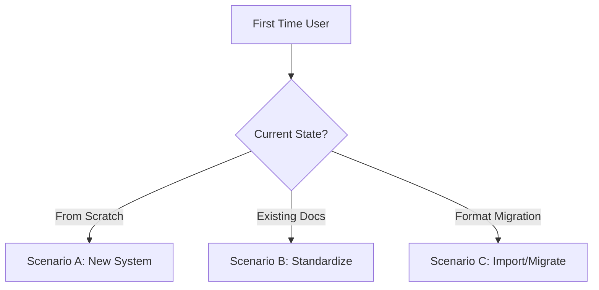
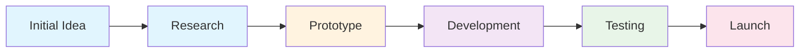
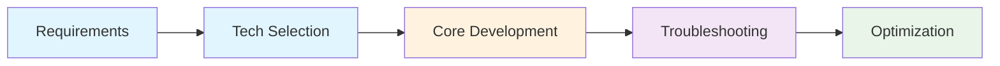
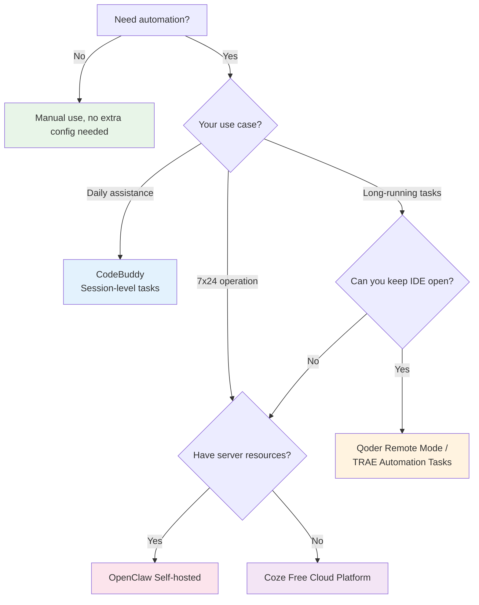

# MD Project Management Skill

## Overview

This Skill provides a complete Markdown-based project management system, enabling AI to:

1. Guide users in creating a project documentation system
2. Auto-optimize voice input content
3. Maintain a project management dashboard
4. Track project progress and issues

## Core Concepts

### Documentation System Structure

Project management consists of two core document types:

| Document Type | File Name Example | Responsibility | Update Frequency |
|---------------|-------------------|---------------|------------------|
| **Master Document** | `项目管理面板.md` (Project Dashboard) | Displays overall progress overview of all projects | Daily/Weekly |
| **Project Document** | `ProjectA.md`, `ProjectB.md` | Records detailed logs for a single project | Each time progress is made |

### File Organization

#### Option 1: Same Directory (Recommended)

```
project-management/
├── project-dashboard.md          # Master document: progress overview
├── project-a.md                  # Project document: detailed log
├── project-b.md
├── project-c.md
├── project-a.assets/             # Resource folder: images, attachments
└── .gitignore                    # Git ignore rules (optional)
```

#### Option 2: Cross-Directory Management

When project documents are scattered across different directories, drives, or even different computers:

```
Master Document (project-dashboard.md)
    │
    ├── Link → Project Doc A (file:///D:/ProjectA/README.md)
    ├── Link → Project Doc B (file:///E:/ProjectB/README.md)
    └── Link → Project Doc C (https://github.com/user/repo)
```

**Advantages**:
1. Flexibility: project docs can be anywhere
2. Centralized management: master document displays all projects
3. Traceable: as long as you record by date, changes are visible

**Disadvantages**:
1. No real-time awareness: AI cannot automatically detect project doc changes
2. Manual trigger needed: user needs to tell AI "update project progress"
3. Link maintenance: if project docs move, links need updating

**Usage**:
1. User says: "Update project progress"
2. AI reads the master document and follows links to project docs
3. AI reads project docs and extracts key information
4. AI updates the master document summary

## User Onboarding Flow

When a user first uses this Skill, follow this onboarding flow:

### Step 0: Quick Assessment

Before starting, ask the user about their current situation:

> **Where are you starting from?**
>
> - **A. From scratch** — No existing project documents
> - **B. Existing docs** — Have some project records, want to standardize them
> - **C. Format migration** — Migrating from another tool

Jump to the corresponding scenario based on their answer:



---

### Scenario A: Starting from Scratch

**Dialogue Example**:

> **User**: I want to use this skill to manage my projects
>
> **AI**: Great! Let me help you set up a project management system. First, I need to confirm a few things:
> 1. What's your working directory? (e.g., `D:/Projects`)
> 2. What projects are you currently working on?
>
> Please let me know, and I'll create the master document and first project document for you.

**Execution Steps**:

1. **Create master document**: Use [Template 1] to generate `project-dashboard.md`
2. **Create first project document**: Use [Template 2] to generate `{ProjectName}.md`
3. **Demonstrate logging**: Show the user how to write their first work entry
4. **Demonstrate AI optimization**: Run an optimization to show the `==highlight==` + `[^aiN]` effect
5. **Explain daily usage**: Tell the user they only need to say "update progress" or "optimize log"

**Verification Checklist**:

- [ ] User can see the two newly created `.md` files
- [ ] Links in the master document navigate to the project document
- [ ] User understands how to log progress and trigger AI optimization

---

### Scenario B: Existing Documents

If the user already has some project records but they're not well-formatted:

1. **Scan existing files**: Check existing `.md` files in the working directory
2. **Assess standardization**: Determine if they need to be reorganized using templates
3. **Gradual improvement**:
   - If content is minimal: suggest reorganizing with templates
   - If content is extensive: preserve original content, supplement missing parts
4. **Add master document**: If a master document is missing, help create one

---

### Scenario C: Migrating from Other Tools

Supports migration from the following tools/platforms to this Skill's Markdown system:

| Source Tool | Migration Method | Difficulty |
|-------------|------------------|------------|
| Notion | Export as Markdown/HTML, clean up style code | Medium |
| Feishu Docs | Export as Markdown or copy text | Easy |
| Trello/Jira | Export data, convert format with script | Higher |
| Excel Spreadsheets | Copy-paste, AI-assisted conversion to Markdown | Easy |
| Paper Notes | Dictate to AI, auto-organize into Markdown | Easy |

**General Migration Steps**:
1. Export raw data from the original platform
2. Use this Skill's templates as the target format
3. AI assists in mapping content to template fields
4. Check that links and image paths are correct

---

### Steps 1-4: Standard Flow (Applicable to All Scenarios)

#### Step 1: Confirm Working Directory

Ask the user:
- Are you already working in a project management folder?
- Or do you need to start from scratch?

#### Step 2: Create Master Document

If the user needs to start from scratch, first create the master document:

```
Inform the user: I'll create a project dashboard for you. This is the core document for managing all your projects.
```

Use the [Master Document Template] below to create `project-dashboard.md`.

#### Step 3: Create First Project Document

Guide the user in creating their first project document:

```
Inform the user: Now let's create your first project document. Tell me the project name, and I'll create the corresponding file.
```

Use the [Project Document Template] below to create the project file.

#### Step 4: Explain Usage

Explain the basic usage to the user:

1. **Log progress**: Record daily progress in the project document using voice or text
2. **Trigger optimization**: Tell AI "optimize today's log" — fully automatic
3. **View overview**: Open `project-dashboard.md` to see all project statuses

## Template Library

### Template 1: Master Document Template

Used to create the project management dashboard, showing overall progress of all projects.

```markdown
# Project Dashboard

## Project Overview

| Project Name | Priority | Progress | Latest Status | Detailed Log |
|-------------|----------|----------|--------------|-------------|
| [Project A] | High | 60% | [Status Summary] | [View Log](project-a.md) |
| [Project B] | Medium | 30% | [Status Summary] | [View Log](project-b.md) |
| [Project C] | Low | 10% | [Status Summary] | [View Log](project-c.md) |

## Cross-Directory Project Links (Optional)

When project docs are in different locations, use absolute paths:

| Project Name | Priority | Progress | Latest Status | Detailed Log |
|-------------|----------|----------|--------------|-------------|
| [Project D] | High | 50% | [Status Summary] | [View Log](file:///D:/ProjectD/README.md) |
| [Project E] | Medium | 20% | [Status Summary] | [View Log](file:///E:/ProjectE/README.md) |
| [Project F] | Low | 10% | [Status Summary] | [View Log](https://github.com/user/repo) |

## Project Categories

### In Progress

- **[Project A]**: [Brief description]
  - Priority: High
  - Progress: 60%
  - Latest: [Status summary]

- **[Project B]**: [Brief description]
  - Priority: Medium
  - Progress: 30%
  - Latest: [Status summary]

### Planning

- **[Project C]**: [Brief description]
  - Priority: Low
  - Progress: 10%
  - Latest: [Status summary]

### Completed

- **[Project D]**: [Brief description]
  - Completion: YYYY-MM-DD
  - Final Status: [Final status]

## Recent Focus

### This Week's Priorities

1. [Priority task 1]
2. [Priority task 2]
3. [Priority task 3]

### Open Issues

- **Issue 1**: [Description] - [Project Name]
- **Issue 2**: [Description] - [Project Name]

### Next Steps

- [ ] [Next task 1]
- [ ] [Next task 2]
- [ ] [Next task 3]

## Statistics

- **Total Projects**: X
- **In Progress**: X
- **Planning**: X
- **Completed**: X

## Changelog

### YYYY-MM-DD

- Updated progress for [Project A]
- Added [Project C] to Planning
- Completed wrap-up for [Project D]

---

[^ai1]: AI optimized at YYYY-MM-DD HH:MM | Language polish
[^ai2]: AI optimized at YYYY-MM-DD HH:MM | Detail expansion
```

### Template 2: Project Document Template

Used to create detailed log documents for individual projects.

```markdown
# Project Name

## Project Overview

Brief description of project goals, background, and current status.

**Goal**: [What the project aims to achieve]

**Background**: [Why the project was started]

**Current Status**: [Current stage of the project]

## Project Evolution



## Progress Log

### YYYY-MM-DD

- **Done**: [Completed tasks]
- **Result**: [Outcome of tasks]
- **Issues**: [Problems encountered]
- **Next**: [Next steps]

### YYYY-MM-DD

- **Done**: [Completed tasks]
- **Result**: [Outcome of tasks]
- **Issues**: [Problems encountered]
- **Next**: [Next steps]

## Issue Tracker

- **Issue 1**: [Description]
  - **Cause**: [Root cause]
  - **Solution**: [Resolution or plan]

- **Issue 2**: [Description]
  - **Cause**: [Root cause]
  - **Solution**: [Resolution or plan]

## Future Directions

- **Direction A**: [Possible direction]
  - **Feasibility**: [Feasibility analysis]
  - **Expected Value**: [Expected benefits]

- **Direction B**: [Another possible direction]
  - **Feasibility**: [Feasibility analysis]
  - **Expected Value**: [Expected benefits]

## References

- [Link 1](https://example.com)
- [Related Document](./related-doc.md)

---

[^ai1]: AI optimized at YYYY-MM-DD HH:MM | Language polish
[^ai2]: AI optimized at YYYY-MM-DD HH:MM | Detail expansion
```

### Template 3: Example - Personal Project Management

A filled-in personal project management example showing how to use the templates in practice:

```markdown
# Personal Project Dashboard

## Project Overview

| Project Name | Priority | Progress | Latest Status | Detailed Log |
|-------------|----------|----------|--------------|-------------|
| WordFlow Voice Assistant | High | 75% | Fixed clipboard paste issue | [View Log](WordFlow.md) |
| MD Project Manager | Medium | 60% | Completed Skill packaging | [View Log](MDPM.md) |
| Personal Blog Rewrite | Low | 20% | Completed tech stack selection | [View Log](BlogRewrite.md) |

## Project Categories

### In Progress

- **WordFlow Voice Assistant**: Voice-to-text tool
  - Priority: High
  - Progress: 75%
  - Latest: Solving cross-window input, testing SendInput API

- **MD Project Manager**: Markdown-based project management solution
  - Priority: Medium
  - Progress: 60%
  - Latest: Completed Skill packaging, optimized user onboarding

### Planning

- **Personal Blog Rewrite**: Rebuild personal blog with Next.js
  - Priority: Low
  - Progress: 20%
  - Latest: Completed tech selection (Next.js + Tailwind CSS)

### Completed

- **Typora Theme Customization**: Custom Typora editor theme
  - Completion: 2026-04-15
  - Final Status: Published on GitHub

## Recent Focus

### This Week's Priorities

1. Fix WordFlow cross-window input issue
2. Improve MD Project Manager documentation
3. Start Blog Rewrite page design

### Open Issues

- **Cross-process input failure**: Windows security mechanism blocking - WordFlow
- **Path compatibility**: Different Typora install paths - MD Project Manager

### Next Steps

- [ ] Test WordFlow admin privilege approach
- [ ] Write MD Project Manager usage tutorial
- [ ] Design blog homepage layout

## Statistics

- **Total Projects**: 3
- **In Progress**: 2
- **Planning**: 1
- **Completed**: 1

## Changelog

### 2026-05-07

- Updated WordFlow troubleshooting progress
- Completed MD Project Manager Skill packaging
- Added Personal Blog Rewrite project

---

[^ai1]: AI optimized at 2026-05-07 09:00 | Structured project information
```

### Template 4: Example - Project Log

A filled-in project log example showing how to record project progress:

```markdown
# WordFlow Voice Assistant

## Project Overview

Develop a voice recognition tool that converts speech to text in real-time and can input text into any window.

**Goal**: Build an efficient voice-to-text tool with cross-window input support

**Background**: Existing voice input tools have compatibility issues, need a custom solution

**Current Status**: Core functionality complete, solving cross-window input issue

## Project Evolution



## Progress Log

### 2026-05-07

- **Done**: Tested SendInput API for cross-window input
- **Result**: Windows security mechanism blocks non-foreground process input
- **Issues**: SendInput lacks permissions in non-foreground threads
- **Next**: Attempt running with administrator privileges

### 2026-05-06

- **Done**: Implemented clipboard + Ctrl+V paste solution
- **Result**: Log shows paste succeeded, but text didn't reach target window
- **Issues**: Target window not correctly receiving input after focus restoration
- **Next**: Optimize window focus restoration logic

### 2026-05-05

- **Done**: Completed voice recognition core functionality
- **Result**: Recognition accuracy above 95%
- **Issues**: None
- **Next**: Start solving cross-window input issue

## Issue Tracker

- **Cross-process input failure**: Windows security mechanism blocks non-foreground process input
  - **Cause**: Windows limits input permissions for non-foreground processes to prevent malware
  - **Solution**: Try admin privileges, UI Automation API, reference open-source projects

- **Clipboard paste ineffective**: Setting clipboard then sending Ctrl+V didn't work
  - **Cause**: Focus restoration timing was off, target window didn't receive keys correctly
  - **Solution**: Optimize window activation sequence, add delay

## Future Directions

- **Direction A**: Use Windows UI Automation API
  - **Feasibility**: High, official Microsoft API
  - **Expected Value**: More stable cross-window input

- **Direction B**: Reference open-source projects like CapsLock+, PowerToys
  - **Feasibility**: Medium, needs source code research
  - **Expected Value**: Learn from proven implementations

## References

- [SendInput API Docs](https://learn.microsoft.com/en-us/windows/win32/api/winuser/nf-winuser-sendinput)
- [UI Automation Guide](https://learn.microsoft.com/en-us/windows/win32/entry-demo/uiauto-uiautomationoverview)

---

[^ai1]: AI optimized at 2026-05-07 09:00 | Structured issues and progress
```

## AI Behavior Specification

### 1. Task Instruction Markers (HTML Comments)

Invisible in Typora, AI can search to locate them:

```markdown
<!-- AI: Optimize the following -->
<!-- AI: Convert to table -->
<!-- AI: Analyze feasibility -->
<!-- AI: Polish language -->
<!-- AI: Update project dashboard -->
```

### 2. Edit Tracking Markers (Highlight + Footnotes)

AI-edited content uses `==highlight==` + `[^aiN]` footnote combination. Two styles available:

#### Style 1: Highlight (Recommended for Typora Users)

Uses Markdown highlight syntax `==highlight==`:

```markdown
### 2026-05-06
==Project progress is smooth, completed sample design and submitted for client review[^ai1].==
==Client feedback was generally positive but requested color scheme adjustments[^ai2].==
Original voice record: Showed the sample to the client today, they said it's mostly fine just needs color changes.
```

**Advantages**: Clean, good visual effect
**Disadvantages**: Requires editor highlight support

#### Style 2: Block Format (Universal Compatible)

Uses blockquotes to mark AI content (for editors that don't support highlighting):

```markdown
> **AI Optimized**: This is the AI-optimized content[^ai1]
```

Or use HTML comment markers:

```markdown
<!-- AI optimization start -->
This is the AI-optimized content
<!-- AI optimization end -->
```

**Advantages**: Universal, works with all Markdown editors
**Disadvantages**: Less visually appealing than highlight

#### Footnote Definition (Unified)

Regardless of which style is used, footnotes go at the end of the document, separated by a horizontal line:

```markdown
---
[^ai1]: AI optimized at 2026-05-06 09:00 | Language polish
[^ai2]: AI optimized at 2026-05-06 09:00 | Detail expansion
```

**Footnote Format Specification**:

| Field | Format | Example |
|-------|--------|---------|
| Timestamp | YYYY-MM-DD HH:MM | 2026-05-07 14:30 |
| Action Type | Language polish / Detail expansion / Structure adjustment / Content expansion | Language polish |

### 3. AI Executable Tasks

| Task Type | Description | Trigger Method |
|-----------|-------------|----------------|
| Language Optimization | Polish informal speech into professional document language | Oral command ("optimize my log") or full-text auto-scan |
| Format Organization | Standardize heading levels, list formats | Oral command or `<!-- AI: organize format -->` |
| Content Expansion | Add details, include examples | Oral command or `<!-- AI: expand content -->` |
| Progress Update | Sync log content to master document | Oral command or `<!-- AI: update progress -->` |
| Issue Analysis | Analyze problem causes, provide solutions | Oral command or `<!-- AI: analyze issue -->` |
| Direction Suggestion | Suggest next steps based on current progress | Oral command or `<!-- AI: suggest direction -->` |

## Workflows

### User Daily Operations

1. **Log Progress**:
   - Record daily progress in the corresponding project document
   - Use voice input, express naturally (no manual markers needed)

2. **Trigger AI Collaboration**:
   - Tell AI "optimize today's log"
   - Or "check which files have changed"
   - Or "update the project dashboard"

3. **Review Progress**:
   - Open `project-dashboard.md` to view all project overviews
   - Click project links to view detailed logs

### AI Operation Flow

#### Same Directory Scenario

1. **Detect Changes**:
   ```bash
   git status          # View new/modified files
   git diff            # View specific changes
   ```

2. **Optimize Content**:
   - Identify informal language, polish into professional text
   - Standardize formatting and terminology
   - Preserve the user's original intent and style
   - Mark changes with `==highlight==` + `[^aiN]`

3. **Update Master Document**:
   - Extract key information from logs
   - Update project status in `project-dashboard.md`
   - Sync progress percentages, status summaries, etc.

4. **Commit & Push** (if using Git):
   ```bash
   git add .
   git commit -m "Update project log: Project Name"
   git push origin master
   ```

#### Cross-Directory Scenario

When the user says "update project progress":

1. **Read Master Document**:
   - Read `project-dashboard.md`
   - Extract all project links

2. **Access Project Documents**:
   - Follow links to each project document
   - Read project document content
   - Extract key information (progress logs, issues, etc.)

3. **Update Master Document**:
   - Update extracted information to the master document
   - Update project status, progress, latest updates
   - Maintain consistent formatting

4. **Feedback to User**:
   - Tell the user which projects were updated
   - List key changes

## Extension Guide

### 1. Template Customization

When the default templates don't meet your needs, customize them as follows:

#### Example: Adding a Sprint Module for Agile Teams

Insert this before the "Progress Log" section in the project document template:

```markdown
## Sprint Iteration

### Sprint 12 (2026-05-01 ~ 2026-05-15)

**Sprint Goal**: Complete user authentication module

| Story Points | Task | Status | Owner |
|-------------|------|--------|-------|
| 3 | Implement JWT login | ✅ Done | Alice |
| 5 | OAuth third-party login | 🔄 In Progress | Bob |
| 2 | Permission middleware | ⬜ Pending | Charlie |

**Retrospective**:
- ✅ Completed: 3/5 story points
- ⚠️ Blockers: OAuth API docs delivered late
- 💡 Improvement: Align on API contracts one week earlier next sprint
```

#### Example: Adding Personal Productivity Tracking

Add quantifiable metrics to progress log entries:

```markdown
### 2026-05-07

- **Focus Time**: 3.5 hours
- **Tasks Completed**: 4 of 5 planned
- **Energy Level**: 🟢 High / 🟡 Medium / 🔴 Low
- **Interruptions**: 2
- **Done**: [Specific work content]
- **Next**: [Follow-up plan]
```

#### Customization Principles

1. **Incremental**: Add modules on top of existing templates, don't start from scratch
2. **Consistent**: New modules should match the original template's style and naming
3. **Reusable**: If multiple projects need a module, add it to the standard template

### 2. Editor Configuration Quick Reference

| Editor | Highlight Support (`==text==`) | Setup Steps | Notes |
|--------|-------------------------------|-------------|-------|
| **Typora** | ✅ Native | Preferences → Markdown → Extended Syntax → Check "Highlight" | **Recommended**, WYSIWYG |
| **Obsidian** | ✅ Native | No additional configuration needed | Supports backlinks, plugin ecosystem |
| **VS Code** | ⚠️ Plugin needed | Install "Markdown All in One", set `markdown.extension.highlight.enabled`: true | Good for developers |
| **Logseq** | ❌ Not supported | Use "Style 2: Block Format" instead | Outliner-style thinking notes |
| **Mark Text** | ✅ Native | Works out of the box | Open source & free |
| **Zettlr** | ⚠️ Partial | Enable Pandoc rendering in preferences | Academic writing friendly |

**Quick Test**: Type `==test highlight==` in your editor. If the text shows a yellow background, it's supported.

### 3. Platform Migration Guide

#### Migrating from Typora to Obsidian

1. Copy the entire project folder (all `.md` files)
2. (Optional) Replace `[link](file.md)` with `[[bidirectional link]]` format
3. In Obsidian settings, set the folder as a "Vault"
4. Install the "Mermaid" plugin to continue rendering flowcharts

#### Migrating from Notion Exports

1. Click `...` in top-right of Notion page → `Export` → Select `Markdown & CSV`
2. Unzip the exported ZIP file
3. Use AI to map Notion's nested structure to this Skill's templates
4. Manually fix image paths (Notion uses absolute URLs)

#### Migrating from Feishu/Yuque

1. Export as `.md` or `.html` format
2. Clean up excess inline style code
3. Follow the migration steps in "Scenario C" to map to this Skill's templates

### 4. Advanced Tips

#### Git Version Management Integration

```bash
# Initialize repository (first time only)
cd your-project-management-directory
git init

# Create .gitignore for temporary files
echo "*.assets/temp/*" >> .gitignore
echo ".DS_Store" >> .gitignore

# Daily commit habit
git add .
git commit -m "Update log: Project Name - YYYY-MM-DD"
```

**Recommended**: Pair with GitHub/GitLab remote repositories for multi-device sync and history tracking.

#### Quick Command Reference

| You Say | AI Does |
|---------|---------|
| "Update progress" | Read recently modified files, update master document |
| "Optimize my log" | Polish informal language, mark changes |
| "What did I do today" | Create a new daily log entry |
| "Show me the dashboard" | Display master document overview |
| "Create a new project" | Guide you to fill in info, generate new project doc |
| "What issues are open" | Summarize all project issues |

## Automation Task Flows

### Overview

This Skill integrates with various AI editors and platforms to enable scheduled auto-optimization of project documents.

### 0. Requirements Guide

Before configuring automation, confirm your needs:



> **Follow the flowchart above to choose the right solution, then jump to the corresponding config section.**

---

### 1. Unified Recommended Prompt (All Platforms)

The following prompt works with **all platforms that support automation tasks**. Just paste it into the appropriate field:

````markdown
Using the md-project-manager skill, perform the following:
1. Check Git changes (git status, git diff) to identify recently modified log content
2. Auto-analyze language style, identify informal/non-standard expressions and optimize them, mark changes with ==highlight== + [^aiN] footnotes
3. Update the master document (project-dashboard.md)
4. Ask the user if they want to push to GitHub
````

**Platform paste locations**:

| Platform | Prompt Location |
|----------|----------------|
| CodeBuddy | Agent mode → Automation tasks → "Prompt" field |
| Qoder | Quest Mode → Quest description box |
| TRAE | SOLO mode → Automation tasks → Prompt input area |
| Coze | Workflow/Agent → System Prompt |
| OpenClaw | Configuration file's agent prompt section |

---

### 2. Platform Capability Comparison

| Platform | Agent Mode | Scheduled Tasks | Cloud Execution | Headless | Best For |
|----------|------------|----------------|-----------------|----------|----------|
| **Cursor** | ✅ Agent | ❌ | ❌ | ❌ | Interactive coding |
| **Windsurf** | ✅ Cascade | ❌ | ❌ | ❌ | Interactive coding |
| **GitHub Copilot** | ✅ Agent | ❌ | ❌ | ❌ | Interactive coding |
| **CodeBuddy** | ✅ Agent | ✅ Session-level | ❌ | ❌ | Daily assistance (IDE open) |
| **Qoder** | ✅ Quest | ✅ Built-in | ✅ Remote mode | ✅ | Long-running, offline tasks |
| **TRAE** | ✅ SOLO | ✅ Automation | ❌ | ❌ | Recurring scheduled tasks |
| **OpenClaw** | ✅ Agent | ✅ Cron | ✅ Cloud deploy | ✅ | Unattended automation |
| **Coze** | ✅ Workflow | ✅ Trigger | ✅ Cloud | ✅ | Free cloud automation |

**Key Findings**:
- **Cursor/Windsurf/Copilot**: Interactive coding only, no built-in scheduling
- **CodeBuddy**: Session-level tasks, stops when IDE closes
- **Qoder**: Remote container execution, local machine can be shut down
- **TRAE**: Creates a new workspace each run, good for stateless tasks
- **OpenClaw/Coze**: Cloud execution, true 7x24 automation

---

### 3. Platform Configuration Guide

#### CodeBuddy (Daily First Choice)

**Limitation**: Session-level, tasks won't run when IDE is closed.

**Setup**:
1. Enter **Agent mode**
2. Click **"Add Automation Task"**
3. Fill in:
   - **Name**: e.g., "Daily project log optimization"
   - **Prompt**: Paste the "Unified Recommended Prompt" above
   - **Frequency**: Daily / Interval / One-time
   - **Validity**: Set an expiration date

#### Qoder (Long-Running Tasks)

**Advantage**: In remote mode, local machine can be shut down; tasks continue in the cloud container.

**Three Execution Environments**:

| Environment | Description | Best For |
|-------------|-------------|----------|
| Local mode | Directly modify the main workspace | Quick experiments, low-risk tasks |
| Worktree | Hidden workspace in background, main branch stays clean | Parallel development, non-disruptive |
| Remote mode | Remote container execution, **local machine can shut down** | Long-running, resource-intensive tasks |

**Setup**: Switch to Quest mode → Create Quest → Select environment → Paste prompt

#### TRAE (Recurring Scheduled Tasks)

**Mechanism**: Execute fixed prompts on schedule, create a new workspace each run (stateless).

**Best For**: Periodic draft generation, change monitoring, fixed workflow execution

**Setup**: SOLO mode → Automation tasks → Set Cron frequency → Paste prompt

#### Coze (Free Cloud Platform)

**Advantage**: Hosted by ByteDance, no server needed, free tier available.

**Setup**: Create Bot → Workflow → Timer trigger → Set Cron expression → Paste prompt

#### OpenClaw (Self-Hosted)

**Advantage**: Fully controllable, open-source framework, deployable on any cloud server.

**Setup**: Write config file → Set cron.schedule → Deploy to cloud server → Paste prompt

---

### 4. Selection Guide

| Time Dimension | Recommended | Reason |
|---------------|-------------|--------|
| **Short-term (immediate)** | CodeBuddy Automation Task | Zero cost, use within IDE |
| **Mid-term (1-3 months)** | Qoder Remote Mode / TRAE | Support longer task cycles |
| **Long-term (continuous)** | Coze / OpenClaw Cloud | 7x24 unattended operation |

### 5. Practical Considerations for "Headless" Automation

**Reality Check**:
- Project logs still need to be written by a human (voice input/text)
- Fully "unattended" automation isn't practical — no new logs means nothing to optimize
- But **semi-automation** works: scheduled AI organization + manual push approval

**Recommended Strategy**:
1. Start with CodeBuddy daily tasks (auto-triggered when you're at your computer)
2. Upgrade to Qoder remote mode when offline capability is needed
3. Only consider cloud solutions when true 7x24 operation is required

## FAQ

### Q: I'm a beginner. How do I start my first project?

A: Follow these 3 quick steps:

1. **Tell AI**: "I want to use project management, help me start from scratch"
2. **Answer two questions**: What's your working directory? What's the project name?
3. **Verify results**: AI will create two files
   - `project-dashboard.md` — Overview of all projects
   - `{YourProjectName}.md` — Detailed log for that project

Then write your work for the day in the project document, try saying "optimize my log" and see how AI marks changes with `==highlight==`.

### Q: How do I manage multiple projects?

A: Use the master document (project dashboard) for unified management. Each project gets its own document, linked together. To add a new project, just create a new `.md` file and register it in the master document.

### Q: How does voice input optimization work?

A: **Fully automatic — no manual steps needed.**

Just:
1. Record your work normally using voice or text
2. Tell AI "optimize today's log"

AI will automatically:
1. Run `git diff` to read your latest changes
2. Full-text scan to identify informal/non-standard expressions
3. Polish into professional document language
4. Mark all changes with `==highlight==` + `[^aiN]` footnotes

**Advanced** (optional):
If you want to target a specific paragraph, add `<!-- AI: Optimize language -->` before it.
But in most cases, just saying "optimize" is enough.

### Q: How do I track project progress?

A: Record progress in the "Progress Log" section by date. Each time the automation task runs, AI will automatically sync key information to the master document's project overview table.

### Q: Can I integrate with other tools?

A: Yes. Markdown is the most universal format:
- **Import from Notion/Feishu**: Export as .md, then reorganize with this Skill's templates (see "Extension Guide → Platform Migration")
- **Git version management**: Initialize a Git repo for history tracking and multi-device sync
- **Other Markdown tools**: Obsidian, Logseq, etc. can all open and edit directly

### Q: Will automation tasks run after I close my IDE?

A: Depends on the platform:
- **CodeBuddy**: No, session-level, stops when IDE closes
- **Qoder Remote Mode**: Yes, tasks run in the cloud container
- **TRAE**: Yes, but creates a new workspace each time (context not shared)
- **Coze/OpenClaw**: Yes, cloud execution, true 7x24

See the flowchart in "Automation Task Flows → Section 0: Requirements Guide" to choose the right solution.

### Q: How do I use this skill on different platforms?

A: The core logic (Markdown document optimization, dashboard updates) is **platform-independent**. The only thing that needs adaptation is each platform's automation configuration. See "Automation Task Flows → Section 1: Unified Recommended Prompt" — that prompt works on all platforms.

### Q: Qoder vs TRAE — which should I choose?

A: Depends on your needs:
- **Qoder**: Best for complex, long-running tasks (e.g., full feature development). Supports remote container execution; local machine can shut down.
- **TRAE**: Best for recurring scheduled tasks (e.g., daily log organization). Each run is independent and stateless.

### Q: `==highlight==` doesn't work in my editor. What do I do?

A: Check the "Extension Guide → Section 2: Editor Configuration Quick Reference" to see if your editor supports it and how to enable it. If not, use "Block Format" (blockquotes) to mark AI changes — it works just as well.

### Q: Won't things get messy with too many projects?

A: No. The master document provides three layers of structure to prevent chaos:
1. **Project Overview Table**: One row per project, clear at a glance
2. **Project Categories**: Organized into "In Progress / Planning / Completed"
3. **Statistics**: Auto-summarized totals

We recommend archiving every 2-4 weeks by moving completed projects to the "Completed" section.
