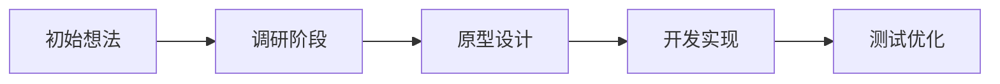

# MD 项目管理 Skill

## 概述

本 Skill 提供一套简洁的 Markdown 项目管理规范，让 AI 能够：
1. 自动更新项目日志
2. 优化语音输入内容
3. 维护项目管理面板

## 核心原则

### 规范层（本文件定义）
- 定义"应该做什么"，不写"怎么做"
- 让 AI 和用户都清楚操作流程

### 实现层（AI 自动实现）
- 提供 Typora 的完整实现作为参考（见 `examples/` 目录）
- 让 AI 根据用户环境自动适配其他编辑器
- 不需要完全适配，但要让 AI 理解并实行

## 项目管理规范

### 文件结构

```
项目管理/
├── A项目管理.md              # 主控文档：所有项目的进度概览
├── 项目A.md                 # 项目文档：单个项目的详细日志
├── 项目B.md
├── 项目A.assets/            # 资源文件夹：项目相关图片、附件
└── .gitignore               # Git 忽略规则
```

### 核心文件分工

| 文件 | 职责 | 更新频率 | 内容特点 |
|------|------|----------|----------|
| `A项目管理.md` | 展示所有项目的整体进度 | 每日/每周 | 表格形式，包含项目名称、优先级、完成度、状态摘要 |
| `项目X.md` | 记录单个项目的详细日志 | 每次有进展时 | 时间线形式，包含具体进展、问题记录、发展方向 |

### 项目文档结构

```markdown
# 项目名称

## 项目概述
简要描述项目目标、背景和当前状态。

## 项目演进


## 进展日志

### YYYY-MM-DD
- 使用简洁的要点形式
- 每个要点描述一个具体进展
- 包含完成的任务、遇到的问题、下一步计划

## 问题记录
- **问题1**：描述问题内容
- **解决方案**：描述解决方案或计划

## 发展方向
- **方向A**：描述可能的发展方向
- **方向B**：描述另一个可能的方向
```

## AI 行为定义

### 标记语法

#### 1. 任务指令标记（HTML 注释）

在 Typora 中不可见，AI 可通过搜索定位：

```markdown
<!-- AI: 优化以下内容 -->
<!-- AI: 转成表格 -->
<!-- AI: 分析可行性 -->
<!-- AI: 润色语言表达 -->
<!-- AI: 更新项目管理主文档 -->
```

#### 2. AI 编辑追踪标记（脚注）

AI 编辑过的内容使用 `==高亮==` + `[^aiN]` 脚注组合标记：

**正文用法**：
```markdown
### 2026-05-06
==项目进展顺利，已完成样品设计并提交客户评审[^ai1]。==
==客户反馈整体满意，但希望在配色上做调整[^ai2]。==
原始语音记录：今天把样品给客户看了，他们说大体还行，就是颜色要改改。
```

**脚注定义**（放在文档末尾，用横线分隔）：
```markdown
---
[^ai1]: AI优化于2026-05-06 09:00 | 语言润色
[^ai2]: AI优化于2026-05-06 09:00 | 补充细节
```

### AI 可执行任务

| 任务类型 | 描述 | 触发方式 |
|----------|------|----------|
| 语言优化 | 将口语化表达润色为规范文档语言 | `<!-- AI: 优化语言 -->` |
| 格式整理 | 统一标题层级、列表格式 | `<!-- AI: 整理格式 -->` |
| 内容扩展 | 补充细节、添加示例 | `<!-- AI: 扩展内容 -->` |
| 进度更新 | 将日志内容同步到主文档 | `<!-- AI: 更新进度 -->` |
| 问题分析 | 分析问题原因，提供解决方案 | `<!-- AI: 分析问题 -->` |
| 方向建议 | 基于当前进展，建议下一步方向 | `<!-- AI: 建议方向 -->` |

## 编辑器适配指南

### 目标

让 AI 根据用户环境自动适配编辑器，实现以下功能：
1. 高亮样式：柔和淡蓝色底色（而非刺眼的黄色）
2. 脚注样式：深蓝色链接，便于识别

### 适配策略

**规范层定义**（本文件）：
- 高亮样式：柔和淡蓝色底色
- 脚注样式：深蓝色链接

**实现层**（AI 自动实现）：
- 检测用户编辑器类型
- 根据编辑器特点自动实现对应样式
- 参考 `examples/` 目录中的 Typora 实现

### Typora 实现参考

见 `examples/typora-highlight.ps1`，包含：
- 自动检测 Typora 安装路径
- 自动修改主题 CSS 文件
- 实现柔和淡蓝色高亮样式
- 实现脚注样式优化

**让 AI 自己去尝试**：
- 其他编辑器（Obsidian、VS Code、Logseq）的适配
- 根据 Typora 的例子，让 AI 反复尝试实现

## 工作流程

### 用户操作

1. **撰写日志**：
   - 在对应的项目文档中记录进展
   - 使用语音输入，自然表达即可
   - 添加 `<!-- AI: 优化语言 -->` 标记需要优化的部分

2. **触发 AI 协作**：
   - 告诉 AI "帮我优化今天的日志"
   - 或 "检查一下哪些文件有变动"

3. **查阅进度**：
   - 打开 `A项目管理.md` 查看所有项目概览
   - 点击项目链接查看详细日志

### AI 操作流程

1. **检测变动**：
   ```bash
   git status          # 查看新增/修改的文件
   git diff            # 查看具体修改内容
   ```

2. **优化内容**：
   - 识别口语化表达，润色为规范语言
   - 统一格式和术语
   - 保持用户原意和风格

3. **更新主文档**：
   - 从日志中提取关键信息
   - 更新 `A项目管理.md` 中的项目状态
   - 同步完成度、进展摘要等

4. **提交推送**：
   ```bash
   git add .
   git commit -m "更新项目日志：项目名称"
   git push origin master
   ```

## 模板引用

- 单个项目文档模板：见 `templates/project-template.md`
- 项目管理主控文档模板：见 `templates/dashboard-template.md`

## 快速上手

见 `docs/quick-start.md`
