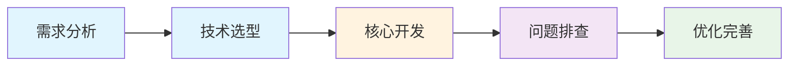

# MD 项目管理 Skill

## 概述

本 Skill 提供一套完整的 Markdown 项目管理方案，让 AI 能够：
1. 引导用户创建项目文档体系
2. 自动优化语音输入内容
3. 维护项目管理面板
4. 追踪项目进展和问题

## 核心概念

### 文档体系结构

项目管理由两类核心文档组成：

| 文档类型 | 文件名示例 | 职责 | 更新频率 |
|----------|------------|------|----------|
| **主控文档** | `项目管理面板.md` | 展示所有项目的整体进度概览 | 每日/每周 |
| **项目文档** | `项目A.md`、`项目B.md` | 记录单个项目的详细日志 | 每次有进展时 |

### 文件组织结构

#### 方案一：同一目录（推荐）

```
项目管理/
├── 项目管理面板.md          # 主控文档：所有项目的进度概览
├── 项目A.md                # 项目文档：单个项目的详细日志
├── 项目B.md
├── 项目C.md
├── 项目A.assets/           # 资源文件夹：项目相关图片、附件
└── .gitignore              # Git 忽略规则（可选）
```

#### 方案二：跨目录管理

当项目文档分散在不同目录、不同盘符、甚至不同电脑时：

```
主控文档（A项目管理.md）
    │
    ├── 链接 → 项目文档A（file:///D:/项目A/README.md）
    ├── 链接 → 项目文档B（file:///E:/项目B/README.md）
    └── 链接 → 项目文档C（https://github.com/user/repo）
```

**优点**：
1. 灵活性：项目文档可以在任何位置
2. 集中管理：主控文档统一展示所有项目
3. 可追溯：只要按日期记录，变化清晰可见

**缺点**：
1. 无法实时感知：AI 不能自动检测项目文档变化
2. 需要手动触发：用户需要告诉 AI "更新项目进度"
3. 链接维护：如果项目文档移动，需要更新链接

**使用方式**：
1. 用户说："更新项目进度"
2. AI 读取主控文档，按链接访问项目文档
3. AI 读取项目文档，提取关键信息
4. AI 更新主控文档的摘要

## 用户引导流程

当用户首次使用本 Skill 时，按以下流程引导：

### 步骤 1：确认工作目录

询问用户：
- 是否在已有项目管理文件夹中工作？
- 还是需要从零开始创建？

### 步骤 2：创建主控文档

如果用户需要从零开始，首先创建主控文档：

```
提示用户：我将为您创建项目管理面板，这是管理所有项目的核心文档。
```

使用下方的【主控文档模板】创建 `项目管理面板.md`。

### 步骤 3：创建第一个项目文档

引导用户创建第一个项目文档：

```
提示用户：现在让我们创建您的第一个项目文档。请告诉我项目名称，我将为您创建对应的文档。
```

使用下方的【项目文档模板】创建对应的项目文件。

### 步骤 4：说明使用方法

向用户说明基本使用方法：
1. **记录进展**：在项目文档中使用语音或文字记录当天进展
2. **触发优化**：告诉 AI "帮我优化今天的日志" 或添加 `<!-- AI: 优化语言 -->` 标记
3. **查看概览**：打开 `项目管理面板.md` 查看所有项目状态

## 模板库

### 模板 1：主控文档模板

用于创建项目管理面板，展示所有项目的整体进度。

```markdown
# 项目管理面板

## 项目概览

| 项目名称 | 优先级 | 完成度 | 最新状态 | 详细日志 |
|----------|--------|--------|----------|----------|
| [项目A] | 高 | 60% | [最新状态摘要] | [查看日志](项目A.md) |
| [项目B] | 中 | 30% | [最新状态摘要] | [查看日志](项目B.md) |
| [项目C] | 低 | 10% | [最新状态摘要] | [查看日志](项目C.md) |

## 跨目录项目链接（可选）

当项目文档分散在不同位置时，使用绝对路径链接：

| 项目名称 | 优先级 | 完成度 | 最新状态 | 详细日志 |
|----------|--------|--------|----------|----------|
| [项目D] | 高 | 50% | [最新状态摘要] | [查看日志](file:///D:/项目D/README.md) |
| [项目E] | 中 | 20% | [最新状态摘要] | [查看日志](file:///E:/项目E/README.md) |
| [项目F] | 低 | 10% | [最新状态摘要] | [查看日志](https://github.com/user/repo) |

## 项目分类

### 进行中

- **[项目A]**：[简要描述]
  - 优先级：高
  - 完成度：60%
  - 最新进展：[最新状态摘要]

- **[项目B]**：[简要描述]
  - 优先级：中
  - 完成度：30%
  - 最新进展：[最新状态摘要]

### 规划中

- **[项目C]**：[简要描述]
  - 优先级：低
  - 完成度：10%
  - 最新进展：[最新状态摘要]

### 已完成

- **[项目D]**：[简要描述]
  - 完成时间：YYYY-MM-DD
  - 最终状态：[最终状态]

## 近期重点

### 本周重点

1. [重点任务1]
2. [重点任务2]
3. [重点任务3]

### 待解决问题

- **问题1**：[问题描述] - [项目名称]
- **问题2**：[问题描述] - [项目名称]

### 下一步计划

- [ ] [计划任务1]
- [ ] [计划任务2]
- [ ] [计划任务3]

## 统计信息

- **总项目数**：X 个
- **进行中**：X 个
- **规划中**：X 个
- **已完成**：X 个

## 更新日志

### YYYY-MM-DD

- 更新了 [项目A] 的进展
- 新增了 [项目C] 到规划中
- 完成了 [项目D] 的收尾工作

---

[^ai1]: AI优化于YYYY-MM-DD HH:MM | 语言润色
[^ai2]: AI优化于YYYY-MM-DD HH:MM | 补充细节
```

### 模板 2：项目文档模板

用于创建单个项目的详细日志文档。

```markdown
# 项目名称

## 项目概述

简要描述项目目标、背景和当前状态。

**目标**：[项目要达成的目标]

**背景**：[项目启动的原因或背景]

**当前状态**：[项目目前的进展阶段]

## 项目演进


## 进展日志

### YYYY-MM-DD

- **做了什么**：[完成的任务]
- **结果如何**：[任务的结果]
- **遇到什么**：[遇到的问题]
- **下一步**：[下一步计划]

### YYYY-MM-DD

- **做了什么**：[完成的任务]
- **结果如何**：[任务的结果]
- **遇到什么**：[遇到的问题]
- **下一步**：[下一步计划]

## 问题记录

- **问题1**：[问题描述]
  - **原因**：[问题原因]
  - **解决方案**：[解决方案或计划]

- **问题2**：[问题描述]
  - **原因**：[问题原因]
  - **解决方案**：[解决方案或计划]

## 发展方向

- **方向A**：[可能的发展方向]
  - **可行性**：[可行性分析]
  - **预期收益**：[预期收益]

- **方向B**：[另一个可能的方向]
  - **可行性**：[可行性分析]
  - **预期收益**：[预期收益]

## 参考资料

- [相关链接1](https://example.com)
- [相关文档](./相关文档.md)

---

[^ai1]: AI优化于YYYY-MM-DD HH:MM | 语言润色
[^ai2]: AI优化于YYYY-MM-DD HH:MM | 补充细节
```

### 模板 3：示例 - 个人项目管理

以下是一个已填充的个人项目管理示例，展示如何实际使用模板：

```markdown
# 个人项目管理面板

## 项目概览

| 项目名称 | 优先级 | 完成度 | 最新状态 | 详细日志 |
|----------|--------|--------|----------|----------|
| WordFlow 语音助手 | 高 | 75% | 修复剪贴板粘贴问题 | [查看日志](WordFlow.md) |
| MD 项目管理工具 | 中 | 60% | 完成 Skill 封装 | [查看日志](MD项目管理.md) |
| 个人博客重构 | 低 | 20% | 完成技术选型 | [查看日志](博客重构.md) |

## 项目分类

### 进行中

- **WordFlow 语音助手**：语音识别转文字工具
  - 优先级：高
  - 完成度：75%
  - 最新进展：解决跨窗口输入问题，测试 SendInput API

- **MD 项目管理工具**：基于 Markdown 的项目管理方案
  - 优先级：中
  - 完成度：60%
  - 最新进展：完成 Skill 封装，优化用户引导流程

### 规划中

- **个人博客重构**：使用 Next.js 重构个人博客
  - 优先级：低
  - 完成度：20%
  - 最新进展：完成技术选型，确定使用 Next.js + Tailwind CSS

### 已完成

- **Typora 主题定制**：自定义 Typora 编辑器主题
  - 完成时间：2026-04-15
  - 最终状态：已发布到 GitHub

## 近期重点

### 本周重点

1. 修复 WordFlow 的跨窗口输入问题
2. 完善 MD 项目管理工具的文档
3. 开始博客重构的页面设计

### 待解决问题

- **跨进程输入失败**：Windows 安全机制阻止 - WordFlow
- **路径兼容性**：不同用户 Typora 安装路径不同 - MD 项目管理

### 下一步计划

- [ ] 测试 WordFlow 的管理员权限方案
- [ ] 编写 MD 项目管理工具的使用教程
- [ ] 设计博客首页布局

## 统计信息

- **总项目数**：3 个
- **进行中**：2 个
- **规划中**：1 个
- **已完成**：1 个

## 更新日志

### 2026-05-07

- 更新了 WordFlow 的问题排查进展
- 完成了 MD 项目管理工具的 Skill 封装
- 新增了个人博客重构项目

---

[^ai1]: AI优化于2026-05-07 09:00 | 结构化整理项目信息
```

### 模板 4：示例 - 项目日志

以下是一个已填充的项目日志示例，展示如何记录项目进展：

```markdown
# WordFlow 语音助手

## 项目概述

开发一个语音识别工具，将语音实时转换为文字，并能输入到任意窗口。

**目标**：实现高效的语音转文字工具，支持跨窗口输入

**背景**：现有语音输入工具存在兼容性问题，需要自研解决方案

**当前状态**：核心功能已完成，正在解决跨窗口输入问题

## 项目演进



## 进展日志

### 2026-05-07

- **做了什么**：测试 SendInput API 跨窗口输入方案
- **结果如何**：发现 Windows 安全机制阻止非前台进程输入
- **遇到什么**：SendInput 在非前台线程权限不足
- **下一步**：尝试以管理员权限运行程序

### 2026-05-06

- **做了什么**：实现剪贴板 + Ctrl+V 粘贴方案
- **结果如何**：日志显示粘贴成功，但实际未输入到目标窗口
- **遇到什么**：焦点恢复后目标窗口未正确接收输入
- **下一步**：优化窗口焦点恢复逻辑

### 2026-05-05

- **做了什么**：完成语音识别核心功能
- **结果如何**：识别准确率达到 95% 以上
- **遇到什么**：暂无
- **下一步**：开始解决跨窗口输入问题

## 问题记录

- **跨进程输入失败**：Windows 安全机制阻止非前台进程输入
  - **原因**：Windows 为防止恶意软件，限制了非前台进程的输入权限
  - **解决方案**：尝试管理员权限、UI Automation API、参考开源项目

- **剪贴板粘贴无效**：设置剪贴板后发送 Ctrl+V 未生效
  - **原因**：焦点恢复时机不对，目标窗口未正确接收按键
  - **解决方案**：优化窗口激活顺序，增加延时等待

## 发展方向

- **方向A**：使用 Windows UI Automation API
  - **可行性**：高，微软官方 API
  - **预期收益**：更稳定的跨窗口输入

- **方向B**：参考 CapsLock+、PowerToys 等开源项目
  - **可行性**：中，需要研究源码
  - **预期收益**：学习成熟的实现方案

## 参考资料

- [SendInput API 文档](https://learn.microsoft.com/en-us/windows/win32/api/winuser/nf-winuser-sendinput)
- [UI Automation 指南](https://learn.microsoft.com/en-us/windows/win32/entry点/uiauto-uiautomationoverview)

---

[^ai1]: AI优化于2026-05-07 09:00 | 结构化整理问题和进展
```

## AI 行为规范

### 标记语法

#### 1. 任务指令标记（HTML 注释）

在 Typora 中不可见，AI 可通过搜索定位：

```markdown
<!-- AI: 优化以下内容 -->
<!-- AI: 转成表格 -->
<!-- AI: 分析可行性 -->
<!-- AI: 润色语言表达 -->
<!-- AI: 更新项目管理主文档 -->
```

#### 2. AI 编辑追踪标记（脚注）

AI 编辑过的内容使用 `==高亮==` + `[^aiN]` 脚注组合标记：

**正文用法**：
```markdown
### 2026-05-06
==项目进展顺利，已完成样品设计并提交客户评审[^ai1]。==
==客户反馈整体满意，但希望在配色上做调整[^ai2]。==
原始语音记录：今天把样品给客户看了，他们说大体还行，就是颜色要改改。
```

**脚注定义**（放在文档末尾，用横线分隔）：
```markdown
---
[^ai1]: AI优化于2026-05-06 09:00 | 语言润色
[^ai2]: AI优化于2026-05-06 09:00 | 补充细节
```

### AI 可执行任务

| 任务类型 | 描述 | 触发方式 |
|----------|------|----------|
| 语言优化 | 将口语化表达润色为规范文档语言 | `<!-- AI: 优化语言 -->` |
| 格式整理 | 统一标题层级、列表格式 | `<!-- AI: 整理格式 -->` |
| 内容扩展 | 补充细节、添加示例 | `<!-- AI: 扩展内容 -->` |
| 进度更新 | 将日志内容同步到主文档 | `<!-- AI: 更新进度 -->` |
| 问题分析 | 分析问题原因，提供解决方案 | `<!-- AI: 分析问题 -->` |
| 方向建议 | 基于当前进展，建议下一步方向 | `<!-- AI: 建议方向 -->` |

## 工作流程

### 用户日常操作

1. **记录进展**：
   - 在对应的项目文档中记录进展
   - 使用语音输入，自然表达即可
   - 添加 `<!-- AI: 优化语言 -->` 标记需要优化的部分

2. **触发 AI 协作**：
   - 告诉 AI "帮我优化今天的日志"
   - 或 "检查一下哪些文件有变动"
   - 或 "更新项目管理面板"

3. **查阅进度**：
   - 打开 `项目管理面板.md` 查看所有项目概览
   - 点击项目链接查看详细日志

### AI 操作流程

#### 同一目录场景

1. **检测变动**：
   ```bash
   git status          # 查看新增/修改的文件
   git diff            # 查看具体修改内容
   ```

2. **优化内容**：
   - 识别口语化表达，润色为规范语言
   - 统一格式和术语
   - 保持用户原意和风格
   - 使用 `==高亮==` + `[^aiN]` 标记修改内容

3. **更新主文档**：
   - 从日志中提取关键信息
   - 更新 `项目管理面板.md` 中的项目状态
   - 同步完成度、进展摘要等

4. **提交推送**（如果使用 Git）：
   ```bash
   git add .
   git commit -m "更新项目日志：项目名称"
   git push origin master
   ```

#### 跨目录场景

当用户说"更新项目进度"时：

1. **读取主控文档**：
   - 读取 `A项目管理.md`
   - 提取所有项目链接

2. **访问项目文档**：
   - 按链接访问每个项目文档
   - 读取项目文档内容
   - 提取关键信息（进展日志、问题记录等）

3. **更新主控文档**：
   - 将提取的信息更新到主控文档
   - 更新项目状态、完成度、最新进展
   - 保持格式一致

4. **反馈给用户**：
   - 告诉用户哪些项目已更新
   - 列出关键变化

## 自定义与扩展

### 引导用户创建自己的模板

在用户熟悉基本使用后，引导他们根据自己的需求定制模板：

1. **分析用户习惯**：观察用户常用的记录方式
2. **提出优化建议**：根据用户需求调整模板结构
3. **创建专属模板**：帮助用户创建适合自己的模板版本

### 编辑器适配

本 Skill 使用标准 Markdown 语法，兼容所有支持 Markdown 的编辑器：
- Typora（推荐，所见即所得）
- Obsidian（支持双向链接）
- VS Code（配合 Markdown 插件）
- Logseq（大纲式编辑）

如需高亮样式，可参考 Typora 的 CSS 自定义方案。

## 常见问题

### Q: 如何管理多个项目？

A: 使用主控文档（项目管理面板）统一管理，每个项目单独一个文档，通过链接相互关联。

### Q: 语音输入的内容如何优化？

A: 添加 `<!-- AI: 优化语言 -->` 标记，然后告诉 AI "帮我优化今天的日志"。

### Q: 如何追踪项目进度？

A: 在项目文档的"进展日志"部分按日期记录，AI 会自动同步到主控文档。

### Q: 可以和其他工具集成吗？

A: 可以。Markdown 文件可直接导入到 Notion、飞书文档等工具，也可通过 Git 进行版本管理。
