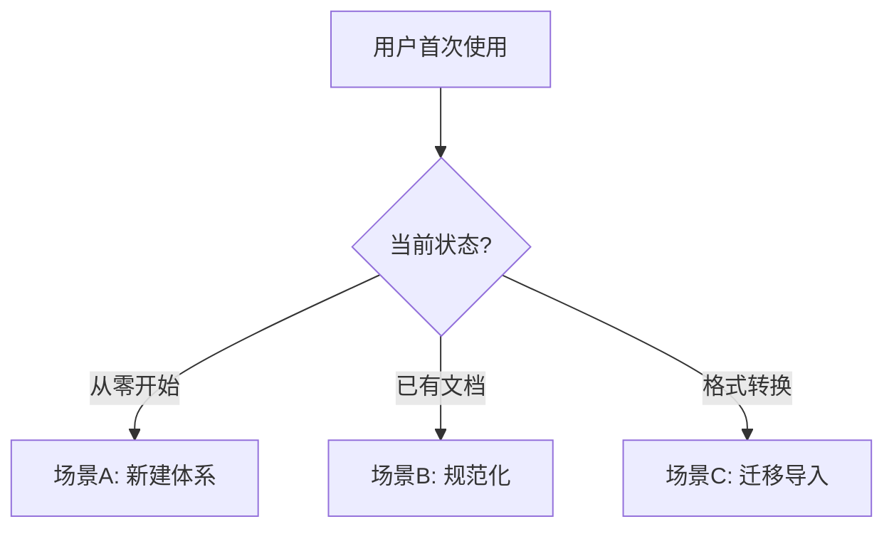
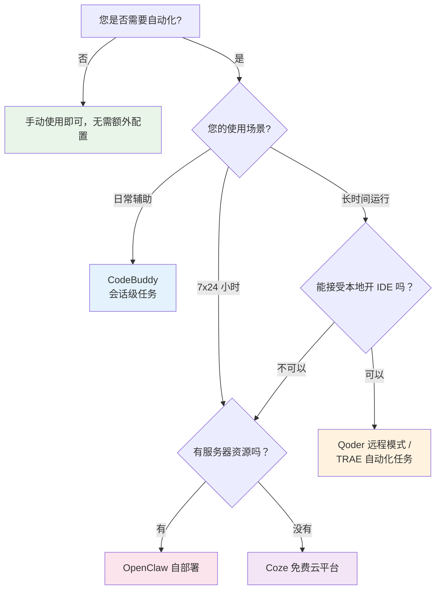

# MD 项目管理 Skill

## 概述

本 Skill 提供一套完整的 Markdown 项目管理方案，让 AI 能够：
1. 引导用户创建项目文档体系
2. 自动优化语音输入内容
3. 维护项目管理面板
4. 追踪项目进展和问题

## 核心概念

### 文档体系结构

项目管理由两类核心文档组成：

| 文档类型 | 文件名示例 | 职责 | 更新频率 |
|----------|------------|------|----------|
| **主控文档** | `项目管理面板.md` | 展示所有项目的整体进度概览 | 每日/每周 |
| **项目文档** | `项目A.md`、`项目B.md` | 记录单个项目的详细日志 | 每次有进展时 |

### 文件组织结构

#### 方案一：同一目录（推荐）

```
项目管理/
├── 项目管理面板.md          # 主控文档：所有项目的进度概览
├── 项目A.md                # 项目文档：单个项目的详细日志
├── 项目B.md
├── 项目C.md
├── 项目A.assets/           # 资源文件夹：项目相关图片、附件
└── .gitignore              # Git 忽略规则（可选）
```

#### 方案二：跨目录管理

当项目文档分散在不同目录、不同盘符、甚至不同电脑时：

```
主控文档（A项目管理.md）
    │
    ├── 链接 → 项目文档A（file:///D:/项目A/README.md）
    ├── 链接 → 项目文档B（file:///E:/项目B/README.md）
    └── 链接 → 项目文档C（https://github.com/user/repo）
```

**优点**：
1. 灵活性：项目文档可以在任何位置
2. 集中管理：主控文档统一展示所有项目
3. 可追溯：只要按日期记录，变化清晰可见

**缺点**：
1. 无法实时感知：AI 不能自动检测项目文档变化
2. 需要手动触发：用户需要告诉 AI "更新项目进度"
3. 链接维护：如果项目文档移动，需要更新链接

**使用方式**：
1. 用户说："更新项目进度"
2. AI 读取主控文档，按链接访问项目文档
3. AI 读取项目文档，提取关键信息
4. AI 更新主控文档的摘要

## 用户引导流程

当用户首次使用本 Skill 时，按以下流程引导：

### 步骤 0：快速判断用户场景

在开始引导前，先询问用户当前状态：

> **请问您现在是？**
>
> - **A. 从零开始** —— 还没有任何项目文档
> - **B. 已有文档** —— 有一些项目记录，想规范化
> - **C. 格式转换** —— 从其他工具迁移过来

根据选择跳转到对应场景：



---

### 场景 A：从零开始（详细示例）

**对话示例**：

> **用户**：我想用这个技能来管理我的项目
>
> **AI**：好的！让我帮您搭建项目管理体系。首先需要确认几个问题：
> 1. 您的工作目录在哪里？（如 `D:/Projects`）
> 2. 您目前有哪些正在进行的项目？
>
> 请告诉我，我将为您创建主控文档和第一个项目文档。

**执行步骤**：

1. **创建主控文档**：使用【模板 1】生成 `项目管理面板.md`
2. **创建第一个项目文档**：使用【模板 2】生成 `{项目名}.md`
3. **演示记录日志**：向用户展示如何写下第一条工作记录
4. **演示 AI 优化效果**：运行一次优化，让用户看到 `==高亮==` + `[^aiN]` 的效果
5. **说明日常使用方法**：告诉用户以后只需说"更新进度"或"优化日志"

**验证清单**：

- [ ] 用户能看到两个新创建的 `.md` 文件
- [ ] 主控文档中的链接能点击跳转到项目文档
- [ ] 用户理解如何记录日志和触发 AI 优化

---

### 场景 B：已有文档

如果用户已有一些项目记录，但格式不规范：

1. **扫描现有文件**：检查工作目录中已有的 `.md` 文件
2. **评估规范度**：判断是否需要按模板重新组织
3. **渐进式改造**：
   - 如果内容较少：建议使用模板重新整理
   - 如果内容较多：保留原内容，在现有基础上补充缺失部分
4. **补充主控文档**：如果缺少主控文档，帮助创建一个

---

### 场景 C：从其他工具迁移

支持从以下工具/平台迁移到本 Skill 的 Markdown 方案：

| 来源工具 | 迁移方式 | 难度 |
|----------|----------|------|
| Notion | 导出为 Markdown/HTML，清理样式代码 | 中等 |
| 飞书文档 | 导出为 Markdown 或复制文本 | 简单 |
| Trello/Jira | 导出数据，用脚本转换格式 | 较高 |
| Excel 表格 | 复制粘贴，AI 辅助转换为 Markdown | 简单 |
| 纸质笔记 | 口述给 AI，自动整理成 Markdown | 简单 |

**通用迁移步骤**：
1. 从原平台导出原始数据
2. 使用本 Skill 的模板作为目标格式
3. AI 辅助将内容映射到模板字段
4. 检查链接、图片路径是否正确

---

### 步骤 1-4：标准流程（适用于所有场景）

#### 步骤 1：确认工作目录

询问用户：
- 是否在已有项目管理文件夹中工作？
- 还是需要从零开始创建？

#### 步骤 2：创建主控文档

如果用户需要从零开始，首先创建主控文档：

```
提示用户：我将为您创建项目管理面板，这是管理所有项目的核心文档。
```

使用下方的【主控文档模板】创建 `项目管理面板.md`。

#### 步骤 3：创建第一个项目文档

引导用户创建第一个项目文档：

```
提示用户：现在让我们创建您的第一个项目文档。请告诉我项目名称，我将为您创建对应的文档。
```

使用下方的【项目文档模板】创建对应的项目文件。

#### 步骤 4：说明使用方法

向用户说明基本使用方法：
1. **记录进展**：在项目文档中使用语音或文字记录当天进展
2. **触发优化**：告诉 AI "帮我优化今天的日志"，全自动处理
3. **查看概览**：打开 `项目管理面板.md` 查看所有项目状态

## 模板库

### 模板 1：主控文档模板

用于创建项目管理面板，展示所有项目的整体进度。

```markdown
# 项目管理面板

## 项目概览

| 项目名称 | 优先级 | 完成度 | 最新状态 | 详细日志 |
|----------|--------|--------|----------|----------|
| [项目A] | 高 | 60% | [最新状态摘要] | [查看日志](项目A.md) |
| [项目B] | 中 | 30% | [最新状态摘要] | [查看日志](项目B.md) |
| [项目C] | 低 | 10% | [最新状态摘要] | [查看日志](项目C.md) |

## 跨目录项目链接（可选）

当项目文档分散在不同位置时，使用绝对路径链接：

| 项目名称 | 优先级 | 完成度 | 最新状态 | 详细日志 |
|----------|--------|--------|----------|----------|
| [项目D] | 高 | 50% | [最新状态摘要] | [查看日志](file:///D:/项目D/README.md) |
| [项目E] | 中 | 20% | [最新状态摘要] | [查看日志](file:///E:/项目E/README.md) |
| [项目F] | 低 | 10% | [最新状态摘要] | [查看日志](https://github.com/user/repo) |

## 项目分类

### 进行中

- **[项目A]**：[简要描述]
  - 优先级：高
  - 完成度：60%
  - 最新进展：[最新状态摘要]

- **[项目B]**：[简要描述]
  - 优先级：中
  - 完成度：30%
  - 最新进展：[最新状态摘要]

### 规划中

- **[项目C]**：[简要描述]
  - 优先级：低
  - 完成度：10%
  - 最新进展：[最新状态摘要]

### 已完成

- **[项目D]**：[简要描述]
  - 完成时间：YYYY-MM-DD
  - 最终状态：[最终状态]

## 近期重点

### 本周重点

1. [重点任务1]
2. [重点任务2]
3. [重点任务3]

### 待解决问题

- **问题1**：[问题描述] - [项目名称]
- **问题2**：[问题描述] - [项目名称]

### 下一步计划

- [ ] [计划任务1]
- [ ] [计划任务2]
- [ ] [计划任务3]

## 统计信息

- **总项目数**：X 个
- **进行中**：X 个
- **规划中**：X 个
- **已完成**：X 个

## 更新日志

### YYYY-MM-DD

- 更新了 [项目A] 的进展
- 新增了 [项目C] 到规划中
- 完成了 [项目D] 的收尾工作

---

[^ai1]: AI优化于YYYY-MM-DD HH:MM | 语言润色
[^ai2]: AI优化于YYYY-MM-DD HH:MM | 补充细节
```

### 模板 2：项目文档模板

用于创建单个项目的详细日志文档。

```markdown
# 项目名称

## 项目概述

简要描述项目目标、背景和当前状态。

**目标**：[项目要达成的目标]

**背景**：[项目启动的原因或背景]

**当前状态**：[项目目前的进展阶段]

## 项目演进


## 进展日志

### YYYY-MM-DD

- **做了什么**：[完成的任务]
- **结果如何**：[任务的结果]
- **遇到什么**：[遇到的问题]
- **下一步**：[下一步计划]

### YYYY-MM-DD

- **做了什么**：[完成的任务]
- **结果如何**：[任务的结果]
- **遇到什么**：[遇到的问题]
- **下一步**：[下一步计划]

## 问题记录

- **问题1**：[问题描述]
  - **原因**：[问题原因]
  - **解决方案**：[解决方案或计划]

- **问题2**：[问题描述]
  - **原因**：[问题原因]
  - **解决方案**：[解决方案或计划]

## 发展方向

- **方向A**：[可能的发展方向]
  - **可行性**：[可行性分析]
  - **预期收益**：[预期收益]

- **方向B**：[另一个可能的方向]
  - **可行性**：[可行性分析]
  - **预期收益**：[预期收益]

## 参考资料

- [相关链接1](https://example.com)
- [相关文档](./相关文档.md)

---

[^ai1]: AI优化于YYYY-MM-DD HH:MM | 语言润色
[^ai2]: AI优化于YYYY-MM-DD HH:MM | 补充细节
```

### 模板 3：示例 - 个人项目管理

以下是一个已填充的个人项目管理示例，展示如何实际使用模板：

```markdown
# 个人项目管理面板

## 项目概览

| 项目名称 | 优先级 | 完成度 | 最新状态 | 详细日志 |
|----------|--------|--------|----------|----------|
| WordFlow 语音助手 | 高 | 75% | 修复剪贴板粘贴问题 | [查看日志](WordFlow.md) |
| MD 项目管理工具 | 中 | 60% | 完成 Skill 封装 | [查看日志](MD项目管理.md) |
| 个人博客重构 | 低 | 20% | 完成技术选型 | [查看日志](博客重构.md) |

## 项目分类

### 进行中

- **WordFlow 语音助手**：语音识别转文字工具
  - 优先级：高
  - 完成度：75%
  - 最新进展：解决跨窗口输入问题，测试 SendInput API

- **MD 项目管理工具**：基于 Markdown 的项目管理方案
  - 优先级：中
  - 完成度：60%
  - 最新进展：完成 Skill 封装，优化用户引导流程

### 规划中

- **个人博客重构**：使用 Next.js 重构个人博客
  - 优先级：低
  - 完成度：20%
  - 最新进展：完成技术选型，确定使用 Next.js + Tailwind CSS

### 已完成

- **Typora 主题定制**：自定义 Typora 编辑器主题
  - 完成时间：2026-04-15
  - 最终状态：已发布到 GitHub

## 近期重点

### 本周重点

1. 修复 WordFlow 的跨窗口输入问题
2. 完善 MD 项目管理工具的文档
3. 开始博客重构的页面设计

### 待解决问题

- **跨进程输入失败**：Windows 安全机制阻止 - WordFlow
- **路径兼容性**：不同用户 Typora 安装路径不同 - MD 项目管理

### 下一步计划

- [ ] 测试 WordFlow 的管理员权限方案
- [ ] 编写 MD 项目管理工具的使用教程
- [ ] 设计博客首页布局

## 统计信息

- **总项目数**：3 个
- **进行中**：2 个
- **规划中**：1 个
- **已完成**：1 个

## 更新日志

### 2026-05-07

- 更新了 WordFlow 的问题排查进展
- 完成了 MD 项目管理工具的 Skill 封装
- 新增了个人博客重构项目

---

[^ai1]: AI优化于2026-05-07 09:00 | 结构化整理项目信息
```

### 模板 4：示例 - 项目日志

以下是一个已填充的项目日志示例，展示如何记录项目进展：

```markdown
# WordFlow 语音助手

## 项目概述

开发一个语音识别工具，将语音实时转换为文字，并能输入到任意窗口。

**目标**：实现高效的语音转文字工具，支持跨窗口输入

**背景**：现有语音输入工具存在兼容性问题，需要自研解决方案

**当前状态**：核心功能已完成，正在解决跨窗口输入问题

## 项目演进


## 进展日志

### 2026-05-07

- **做了什么**：测试 SendInput API 跨窗口输入方案
- **结果如何**：发现 Windows 安全机制阻止非前台进程输入
- **遇到什么**：SendInput 在非前台线程权限不足
- **下一步**：尝试以管理员权限运行程序

### 2026-05-06

- **做了什么**：实现剪贴板 + Ctrl+V 粘贴方案
- **结果如何**：日志显示粘贴成功，但实际未输入到目标窗口
- **遇到什么**：焦点恢复后目标窗口未正确接收输入
- **下一步**：优化窗口焦点恢复逻辑

### 2026-05-05

- **做了什么**：完成语音识别核心功能
- **结果如何**：识别准确率达到 95% 以上
- **遇到什么**：暂无
- **下一步**：开始解决跨窗口输入问题

## 问题记录

- **跨进程输入失败**：Windows 安全机制阻止非前台进程输入
  - **原因**：Windows 为防止恶意软件，限制了非前台进程的输入权限
  - **解决方案**：尝试管理员权限、UI Automation API、参考开源项目

- **剪贴板粘贴无效**：设置剪贴板后发送 Ctrl+V 未生效
  - **原因**：焦点恢复时机不对，目标窗口未正确接收按键
  - **解决方案**：优化窗口激活顺序，增加延时等待

## 发展方向

- **方向A**：使用 Windows UI Automation API
  - **可行性**：高，微软官方 API
  - **预期收益**：更稳定的跨窗口输入

- **方向B**：参考 CapsLock+、PowerToys 等开源项目
  - **可行性**：中，需要研究源码
  - **预期收益**：学习成熟的实现方案

## 参考资料

- [SendInput API 文档](https://learn.microsoft.com/en-us/windows/win32/api/winuser/nf-winuser-sendinput)
- [UI Automation 指南](https://learn.microsoft.com/en-us/windows/win32/entry点/uiauto-uiautomationoverview)

---

[^ai1]: AI优化于2026-05-07 09:00 | 结构化整理问题和进展
```

## AI 行为规范

### 1. 任务指令标记（HTML 注释）

在 Typora 中不可见，AI 可通过搜索定位：

```markdown
<!-- AI: 优化以下内容 -->
<!-- AI: 转成表格 -->
<!-- AI: 分析可行性 -->
<!-- AI: 润色语言表达 -->
<!-- AI: 更新项目管理主文档 -->
```

### 2. 编辑追踪标记（高亮 + 脚注）

AI 编辑过的内容使用 `==高亮==` + `[^aiN]` 脚注组合标记，提供两种风格供选择：

#### 方式一：高亮方式（推荐 Typora 用户）

使用 Markdown 高亮语法 `==高亮==`：

```markdown
### 2026-05-06
==项目进展顺利，已完成样品设计并提交客户评审[^ai1]。==
==客户反馈整体满意，但希望在配色上做调整[^ai2]。==
原始语音记录：今天把样品给客户看了，他们说大体还行，就是颜色要改改。
```

**优点**：简洁，视觉效果好
**缺点**：需要编辑器开启高亮功能

#### 方式二：块形式（通用兼容方案）

使用引用块标记 AI 内容（适合不支持高亮的编辑器）：

```markdown
> **AI 优化内容**：这是 AI 优化后的内容[^ai1]
```

或者使用 HTML 注释标记范围：

```markdown
<!-- AI 优化开始 -->
这是 AI 优化后的内容
<!-- AI 优化结束 -->
```

**优点**：通用，所有 Markdown 编辑器都支持
**缺点**：视觉效果可能不如高亮

#### 脚注定义（统一）

无论使用哪种方式，脚注都放在文档末尾，用横线分隔：

```markdown
---
[^ai1]: AI优化于2026-05-06 09:00 | 语言润色
[^ai2]: AI优化于2026-05-06 09:00 | 补充细节
```

**脚注格式规范**：

| 字段 | 格式 | 示例 |
|------|------|------|
| 时间戳 | YYYY-MM-DD HH:MM | 2026-05-07 14:30 |
| 操作类型 | 语言润色 / 补充细节 / 结构调整 / 内容扩展 | 语言润色 |

### 3. AI 可执行任务

| 任务类型 | 描述 | 触发方式 |
|----------|------|----------|
| 语言优化 | 将口语化表达润色为规范文档语言 | 口头指令（「帮我优化日志」）或全文自动扫描 |
| 格式整理 | 统一标题层级、列表格式 | 口头指令或 `<!-- AI: 整理格式 -->` |
| 内容扩展 | 补充细节、添加示例 | 口头指令或 `<!-- AI: 扩展内容 -->` |
| 进度更新 | 将日志内容同步到主文档 | 口头指令或 `<!-- AI: 更新进度 -->` |
| 问题分析 | 分析问题原因，提供解决方案 | 口头指令或 `<!-- AI: 分析问题 -->` |
| 方向建议 | 基于当前进展，建议下一步方向 | 口头指令或 `<!-- AI: 建议方向 -->` |

## 工作流程

### 用户日常操作

1. **记录进展**：
   - 在对应的项目文档中记录进展
   - 使用语音输入，自然表达即可（无需手动加任何标记）

2. **触发 AI 协作**：
   - 告诉 AI "帮我优化今天的日志"
   - 或 "检查一下哪些文件有变动"
   - 或 "更新项目管理面板"

3. **查阅进度**：
   - 打开 `项目管理面板.md` 查看所有项目概览
   - 点击项目链接查看详细日志

### AI 操作流程

#### 同一目录场景

1. **检测变动**：
   ```bash
   git status          # 查看新增/修改的文件
   git diff            # 查看具体修改内容
   ```

2. **优化内容**：
   - 识别口语化表达，润色为规范语言
   - 统一格式和术语
   - 保持用户原意和风格
   - 使用 `==高亮==` + `[^aiN]` 标记修改内容

3. **更新主文档**：
   - 从日志中提取关键信息
   - 更新 `项目管理面板.md` 中的项目状态
   - 同步完成度、进展摘要等

4. **提交推送**（如果使用 Git）：
   ```bash
   git add .
   git commit -m "更新项目日志：项目名称"
   git push origin master
   ```

#### 跨目录场景

当用户说"更新项目进度"时：

1. **读取主控文档**：
   - 读取 `A项目管理.md`
   - 提取所有项目链接

2. **访问项目文档**：
   - 按链接访问每个项目文档
   - 读取项目文档内容
   - 提取关键信息（进展日志、问题记录等）

3. **更新主控文档**：
   - 将提取的信息更新到主控文档
   - 更新项目状态、完成度、最新进展
   - 保持格式一致

4. **反馈给用户**：
   - 告诉用户哪些项目已更新
   - 列出关键变化

## 扩展指南

### 1. 模板定制实战

当默认模板无法满足需求时，可以基于以下方式进行定制：

#### 示例：为敏捷团队添加 Sprint 模块

在项目文档模板的「进展日志」之前插入：

```markdown
## Sprint 迭代

### Sprint 12（2026-05-01 ~ 2026-05-15）

**Sprint 目标**：完成用户认证模块开发

| 故事点 | 任务 | 状态 | 负责人 |
|--------|------|------|--------|
| 3 | 实现 JWT 登录 | ✅ 完成 | 张三 |
| 5 | OAuth 第三方登录 | 🔄 进行中 | 李四 |
| 2 | 权限中间件 | ⬜ 待开始 | 王五 |

**回顾总结**：
- ✅ 完成情况：完成 3/5 个故事点
- ⚠️ 阻塞问题：OAuth 接口文档延迟交付
- 💡 改进措施：下次提前一周对齐接口
```

#### 示例：添加个人效率追踪字段

在进展日志条目中增加可量化的指标：

```markdown
### 2026-05-07

- **专注时长**：3.5 小时
- **完成任务**：4 个（计划 5 个）
- **能量水平**：🟢 高 / 🟡 中 / 🔴 低
- **干扰次数**：2 次
- **做了什么**：[具体工作内容]
- **下一步**：[后续计划]
```

#### 定制原则

1. **增量式**：在原有模板基础上增加模块，而非推倒重来
2. **保持一致**：新增模块的风格和命名与原模板统一
3. **考虑复用**：如果多个项目都需要某模块，将其纳入标准模板

### 2. 编辑器配置速查表

| 编辑器 | 高亮支持 (`==text==`) | 配置步骤 | 备注 |
|--------|---------------------|----------|------|
| **Typora** | ✅ 原生支持 | 偏好设置 → Markdown → 扩展语法 → 勾选「高亮」 | **推荐**，所见即所得 |
| **Obsidian** | ✅ 原生支持 | 无需额外配置 | 支持双向链接、插件生态 |
| **VS Code** | ⚠️ 需插件 | 安装「Markdown All in One」，设置 `markdown.extension.highlight.enabled`: true | 适合开发者 |
| **Logseq** | ❌ 不支持 | 使用「方式二：块形式」替代 | 大纲式思维笔记 |
| **Mark Text** | ✅ 原生支持 | 开箱即用 | 开源免费 |
| **Zettlr** | ⚠️ 部分支持 | 偏好设置中启用 Pandoc 渲染 | 学术写作友好 |

**快速检测方法**：在编辑器中输入 `==测试高亮==`，如果文字变成黄色背景则表示支持。

### 3. 平台迁移指南

#### 从 Typora 迁移到 Obsidian

1. 直接复制整个项目文件夹（都是 `.md` 文件）
2. （可选）将 `[链接](file.md)` 替换为 `[[双向链接]]` 格式
3. 在 Obsidian 设置中将文件夹指定为「Vault」
4. 安装「Mermaid」插件以继续渲染流程图

#### 从 Notion 导出迁移

1. 在 Notion 页面右上角 `...` → `Export` → 选择 `Markdown & CSV`
2. 解压导出的 ZIP 文件
3. 用 AI 将 Notion 特有的嵌套结构映射为本 Skill 模板
4. 手动修正图片路径（Notion 导出的图片是绝对 URL）

#### 从飞书/语雀迁移

1. 导出为 `.md` 或 `.html` 格式
2. 清理多余的内联样式代码
3. 按「场景 C」的迁移步骤映射到本 Skill 模板

### 4. 进阶技巧

#### Git 版本管理集成

```bash
# 初始化仓库（仅第一次）
cd 你的项目管理目录
git init

# 创建 .gitignore 忽略临时文件
echo "*.assets/temp/*" >> .gitignore
echo ".DS_Store" >> .gitignore

# 日常提交习惯
git add .
git commit -m "更新日志：项目名称 - YYYY-MM-DD"
```

**推荐配合 GitHub/Gitee 远程仓库**，实现多设备同步和历史回溯。

#### 快捷操作速查

| 你想说 | AI 会做 |
|--------|---------|
| 「更新一下进度」 | 读取最近修改的文件，更新主控文档 |
| 「帮我优化日志」 | 润色口语表达，标记修改处 |
| 「今天做了什么」 | 创建新的日期日志条目 |
| 「看看项目面板」 | 展示主控文档概览 |
| 「新建个项目」 | 引导你填写信息，生成新项目文档 |
| 「有什么问题待解决」 | 汇总所有项目的问题记录 |

## 自动化任务流

### 概述

本技能支持与多种 AI 编辑器和平台的自动化任务功能集成，实现定时自动优化项目文档。

### 0. 需求引导

在配置自动化前，请先确认您的需求：



> **请根据上方流程图选择适合您的方案，然后跳转到对应的配置章节。**

---

### 1. 统一推荐提示词（所有平台通用）

以下提示词适用于**所有支持自动化任务的平台**，只需根据平台填入对应位置即可：

````markdown
使用 md-project-manager 技能，执行以下操作：
1. 检查 Git 变更（git status, git diff），识别最近修改的日志内容
2. 自动分析语言风格，识别口语化/不规范的表达并优化，使用 ==高亮== + [^aiN] 标记修改部分
3. 更新主控文档（项目管理面板.md）
4. 询问用户是否需要推送到 GitHub
````

**各平台填入位置一览**：

| 平台 | 提示词填入位置 |
|------|---------------|
| CodeBuddy | Agent 模式 → 自动化任务 →「提示词」字段 |
| Qoder | Quest Mode → Quest 描述框 |
| TRAE | SOLO 模式 → 自动化任务 → prompt 输入区 |
| Coze | 工作流/Agent → System Prompt 中 |
| OpenClaw | 配置文件的 agent prompt 部分 |

---

### 2. 平台能力对比

| 平台 | Agent 模式 | 定时任务 | 云端执行 | 无头运行 | 适合场景 |
|------|------------|----------|----------|----------|----------|
| **Cursor** | ✅ Agent | ❌ | ❌ | ❌ | 交互式编码辅助 |
| **Windsurf** | ✅ Cascade | ❌ | ❌ | ❌ | 交互式编码辅助 |
| **GitHub Copilot** | ✅ Agent | ❌ | ❌ | ❌ | 交互式编码辅助 |
| **CodeBuddy** | ✅ Agent | ✅ 会话级 | ❌ | ❌ | 日常辅助（IDE 开启时） |
| **Qoder** | ✅ Quest | ✅ 内置 | ✅ 远程模式 | ✅ | 长程任务、关机运行 |
| **TRAE** | ✅ SOLO | ✅ 自动化 | ❌ | ❌ | 定时重复性任务 |
| **OpenClaw** | ✅ Agent | ✅ Cron | ✅ 云端部署 | ✅ | 无人值守自动化 |
| **Coze** | ✅ 工作流 | ✅ 触发器 | ✅ 云端 | ✅ | 免费云端自动化 |

**关键发现**：
- **Cursor/Windsurf/Copilot**：专注交互式编程，无内置定时任务能力
- **CodeBuddy**：会话级定时任务，关闭 IDE 后停止
- **Qoder**：远程容器执行，本地可完全关机
- **TRAE**：每次运行创建独立工作空间，适合无状态任务
- **OpenClaw/Coze**：云端执行，可实现真正的 7x24 自动化

---

### 3. 各平台配置要点

#### CodeBuddy（日常首选）

**限制**：会话级别，关闭 IDE 后任务不执行。

**配置步骤**：
1. 进入 **Agent 模式**
2. 点击 **「添加自动化任务」**
3. 填写：
   - **名称**：如「每日项目日志优化」
   - **提示词**：粘贴上方的「统一推荐提示词」
   - **执行频率**：每天 / 按间隔 / 单次
   - **生效日期**：设置有效期

#### Qoder（长程任务）

**优势**：远程模式下本地可关机断网，任务在云端容器持续执行。

**三种执行环境**：

| 环境 | 说明 | 适用场景 |
|------|------|----------|
| 本地模式 | 直接在主工作区修改 | 快速实验、低风险任务 |
| Worktree | 后台隐藏工作区，主分支保持干净 | 并行开发、不影响主线 |
| 远程模式 | 远程容器执行，**本地可关机** | 长时间运行、资源密集型任务 |

**配置要点**：切换到 Quest 模式 → 创建 Quest → 选环境 → 填入提示词

#### TRAE（定时重复任务）

**机制**：定时执行固定提示词，每次运行创建新工作空间（无状态）。

**适用场景**：定期生成草稿、监控变化、执行固定流程

**配置要点**：SOLO 模式 → 自动化任务 → 设 Cron 频率 → 填入提示词

#### Coze（免费云平台）

**优势**：字节跳动托管，无需自己的服务器，有免费额度。

**配置要点**：创建 Bot → 工作流 → 定时触发器 → 设 Cron 表达式 → 填入提示词

#### OpenClaw（自部署）

**优势**：完全可控，开源框架，可部署在任何云服务器。

**配置要点**：编写配置文件 → 设置 cron.schedule → 部署到云服务器 → 填入提示词

---

### 4. 选择建议

| 时间维度 | 推荐方案 | 理由 |
|----------|----------|------|
| **短期（立即用）** | CodeBuddy 自动化任务 | 零成本，IDE 内即可使用 |
| **中期（1-3个月）** | Qoder 远程模式 / TRAE | 支持更长任务周期 |
| **长期（持续运行）** | Coze / OpenClaw 云端部署 | 7x24 无人值守 |

### 5. 关于"无头"自动化的现实考量

**现状**：
- 项目日志本身需要人来撰写（语音输入/文字记录）
- 完全"无人值守"的自动化不太现实——没有新日志就不需要优化
- 但可以实现**半自动化**：定时触发 AI 整理 + 人工确认推送

**推荐策略**：
1. 以 CodeBuddy 日常任务为主（人在电脑旁时自动触发）
2. 需要离线能力时升级到 Qoder 远程模式
3. 只有确实需要 7x24 运行时才考虑云端方案

## 常见问题

### Q: 我是新手，如何开始第一个项目？

A: 按以下 3 步快速上手：

1. **告诉 AI**：「我想用项目管理功能，帮我从零开始」
2. **回答两个问题**：工作目录在哪？项目叫什么名字？
3. **验证成果**：AI 会创建两个文件
   - `项目管理面板.md` —— 所有项目的总览表
   - `你的项目名.md` —— 该项目的详细日志

然后在项目文档里写下今天的工作内容，试着说一句「帮我优化日志」，看看 AI 如何用 `==高亮==` 标记修改的地方。

### Q: 如何管理多个项目？

A: 使用主控文档（项目管理面板）统一管理，每个项目单独一个文档，通过链接相互关联。新增项目时只需创建一个新的 `.md` 文件并在主控文档中注册即可。

### Q: 语音输入的内容如何优化？

A: **默认全自动，无需任何手动操作。**

你只需要：
1. 用语音/文字正常记录工作内容
2. 对 AI 说一句「帮我优化今天的日志」

AI 会自动完成以下操作：
1. 通过 `git diff` 读取你的最新变更
2. 全文扫描，自动识别口语化/不规范的表达
3. 润色为规范的文档语言
4. 用 `==高亮背景==` + `[^aiN]` 脚注标记所有修改

**进阶用法**（可选）：
如果想精确指定某一段落进行优化，可在该段落前添加 `<!-- AI: 优化语言 -->` 标记。
但大多数情况下不需要这样做，直接说「帮我优化」就够用了。

### Q: 如何追踪项目进度？

A: 在项目文档的「进展日志」部分按日期记录，每次执行自动化任务时，AI 会自动将关键信息同步到主控文档的项目概览表中。

### Q: 可以和其他工具集成吗？

A: 可以。Markdown 是最通用的格式：
- **导入 Notion/飞书**：导出为 .md 后用本 Skill 模板重新组织（参见「扩展指南 → 平台迁移」）
- **Git 版本管理**：初始化 Git 仓库即可实现历史追溯和多设备同步
- **其他 Markdown 工具**：Obsidian、Logseq 等均可直接打开编辑

### Q: 关闭 IDE 后自动化任务还能执行吗？

A: 取决于使用的平台：
- **CodeBuddy**：不能，会话级别，关闭 IDE 即停止
- **Qoder 远程模式**：能，任务在云端容器运行
- **TRAE**：能，但每次创建新工作空间，上下文不互通
- **Coze/OpenClaw**：能，云端执行，真正 7x24 运行

详见「自动化任务流 → 第 0 节：需求引导」中的流程图，选择适合你的方案。

### Q: 如何在不同平台上使用这个技能？

A: 技能的核心逻辑（Markdown 文档优化、主控更新）是**平台无关的**。唯一需要适配的是各平台的自动化配置方式，详见「自动化任务流 → 第 1 节：统一推荐提示词」，该提示词在所有平台通用。

### Q: Qoder 和 TRAE 怎么选？

A: 看你的核心诉求：
- **Qoder**：适合复杂长程任务（如完整功能开发），支持远程容器执行，本地可以关机
- **TRAE**：适合定时重复性任务（如每日日志整理），每次运行独立无状态

### Q: `==高亮==` 在我的编辑器里不生效怎么办？

A: 请对照「扩展指南 → 第 2 节：编辑器配置速查表」检查你的编辑器是否支持以及如何开启。如果不支持，可以使用「块形式」（引用块）来标记 AI 修改内容，效果同样清晰。

### Q: 项目多了之后文档会不会很乱？

A: 不会。主控文档提供了三层结构防止混乱：
1. **项目概览表**：一行一个项目，一目了然
2. **项目分类**：分为「进行中 / 规划中 / 已完成」三组
3. **统计信息**：自动汇总总数

建议每 2-4 周做一次归档，将已完成的项目移入「已完成」分组。
