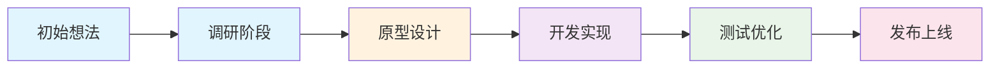

# 项目名称

## 项目概述

简要描述项目目标、背景和当前状态。

**目标**：[项目要达成的目标]

**背景**：[项目启动的原因或背景]

**当前状态**：[项目目前的进展阶段]

## 项目演进

## 进展日志

### YYYY-MM-DD

- **做了什么**：[完成的任务]
- **结果如何**：[任务的结果]
- **遇到什么**：[遇到的问题]
- **下一步**：[下一步计划]

### YYYY-MM-DD

- **做了什么**：[完成的任务]
- **结果如何**：[任务的结果]
- **遇到什么**：[遇到的问题]
- **下一步**：[下一步计划]

## 问题记录

- **问题1**：[问题描述]
  - **原因**：[问题原因]
  - **解决方案**：[解决方案或计划]

- **问题2**：[问题描述]
  - **原因**：[问题原因]
  - **解决方案**：[解决方案或计划]

## 发展方向

- **方向A**：[可能的发展方向]
  - **可行性**：[可行性分析]
  - **预期收益**：[预期收益]

- **方向B**：[另一个可能的方向]
  - **可行性**：[可行性分析]
  - **预期收益**：[预期收益]

## 参考资料

- [相关链接1](https://example.com)
- [相关文档](./相关文档.md)

---

[^ai1]: AI优化于YYYY-MM-DD HH:MM | 语言润色
[^ai2]: AI优化于YYYY-MM-DD HH:MM | 补充细节
